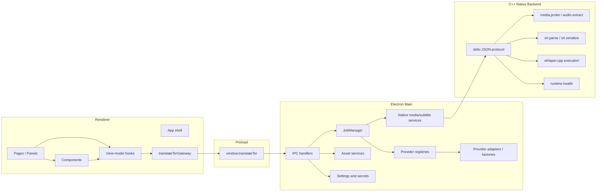

# 架构更新完成态说明

本文记录 PR8 到 PR13 完成后的集成现状。它对应当前已经落地的架构，不再描述额外的新目标。

## 完成结果

- 前端页面可以在 `components`、`viewModels` 和 `app` 层独立迭代，不需要直接触碰 Electron Main 或 C++ backend。
- 新增 provider 的主要改动集中在 shared `provider catalog` 和 Main 侧 `registry/adapter`。
- 本地媒体、字幕格式和 `whisper.cpp` 执行等能力已经收敛到 C++ backend 服务边界。
- TypeScript 保持在 UI、编排、配置、provider HTTP 和安全边界上的职责。
- Native protocol 在本轮集成中没有新增命令，保持稳定。

## 当前分层



## Renderer 当前结构

```text
apps/desktop/src/renderer/
  api/
    translateTerGateway.ts
  app/
    App.tsx
    constants.ts
    displayHelpers.ts
    types.ts
  components/
    workspace/
    settings/
    subtitles/
    status/
    export/
  viewModels/
    useWorkspaceViewModel.ts
    useSettingsViewModel.ts
    useProviderStatusViewModel.ts
    useJobEvents.ts
    useAssetEvents.ts
  i18n.ts
  styles.css
  main.tsx
```

当前职责：

- `main.tsx` 只负责 React mount。
- `app/App.tsx` 负责应用级装配。
- `api/translateTerGateway.ts` 是 Renderer 内默认直接访问 `window.translateTer` 的位置。
- `viewModels/*` 负责读取设置、订阅事件、推导 UI 状态、调用 gateway。
- `components/*` 负责展示和局部交互，不直接写 IPC 细节。

## Provider 当前结构

```text
apps/desktop/src/shared/providers/
  types.ts
  catalog.ts
  catalog.test.ts

apps/desktop/src/main/providers/
  asrProviderRegistry.ts
  translationProviderRegistry.ts
  adapters/
    localWhisperCppAsrProvider.ts
    fasterWhisperAsrProvider.ts
    cloudOpenAiAsrProvider.ts
    openAiCompatibleTranslationProviderFactory.ts
```

当前职责：

- `shared/providers/catalog.ts` 记录 provider 元数据和配置 schema。
- Renderer 通过 catalog 渲染 provider 列表和 secret 表单。
- Main 通过 registry 找到 health check、ASR adapter 或 translation factory。
- `JobManager` 只选择 provider adapter，不实现 provider 细节。

新增 provider 的理想改动路径保持为：

```text
1. 在 shared/providers/catalog.ts 注册 provider 元数据。
2. 在 main/providers/adapters 添加 adapter 或 factory。
3. 在 registry 中注册 adapter。
4. 增加 catalog/registry/provider 行为测试。
5. 如需 UI 文案，补 i18n key。
```

## Native backend 当前边界

C++ backend 继续通过 stdio JSON 暴露本地能力：

```text
runtime.health
media.probe
audio.extract
asr.transcribe
srt.parse
srt.serialize
job.cancel
```

当前边界：

- C++ backend 承担本地工具执行和格式严格的本地处理。
- Electron Main 负责启动 native process、超时、错误转换和事件转发。
- Renderer 不知道 native process 细节。
- Provider HTTP adapter 不下沉到 C++。

## JobManager 当前职责

`JobManager` 当前保留：

- job 创建、取消、快照和事件。
- 工作流阶段推进。
- runtime/media/ASR/translation/export 的顺序编排。
- 失败、warning、retryable 状态归一化。

`JobManager` 当前不承担：

- 每个 ASR provider 的具体实现。
- cloud provider HTTP 请求细节。
- provider secret 字段结构。
- Renderer UI 状态推导。

## 已实现的修改边界

普通页面调整应优先只涉及：

```text
apps/desktop/src/renderer/components
apps/desktop/src/renderer/viewModels
apps/desktop/src/renderer/app
apps/desktop/src/renderer/styles.css
apps/desktop/src/renderer/i18n.ts
```

普通 provider 变更应优先只涉及：

```text
apps/desktop/src/shared/providers
apps/desktop/src/main/providers
apps/desktop/src/shared/translation/providers.ts
apps/desktop/src/main/services/providerHealth.ts
```

只有在新增必须下沉到本地工具的能力时，才修改：

```text
backend/cpp
contracts/native-protocol.md
```

## 当前约束

- 不引入运行时加载外部 provider 插件。
- 不把 provider secret 放进 Renderer 文件系统通道。
- 不让组件直接访问 native process。
- 不让 C++ backend 管理下载、manifest 信任或 secret。
- 不把 UI 改版和 provider 扩展混在同一个集成 PR。
