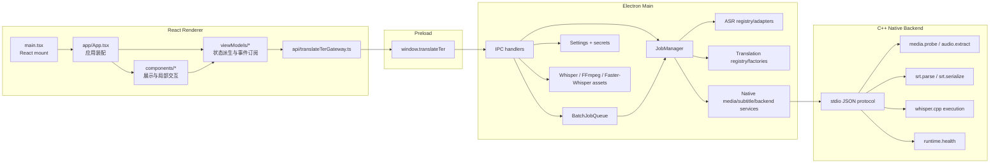
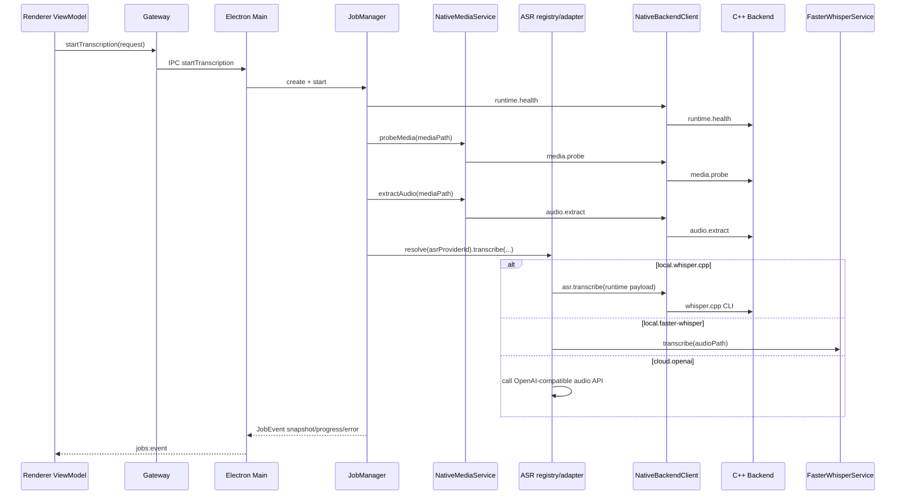
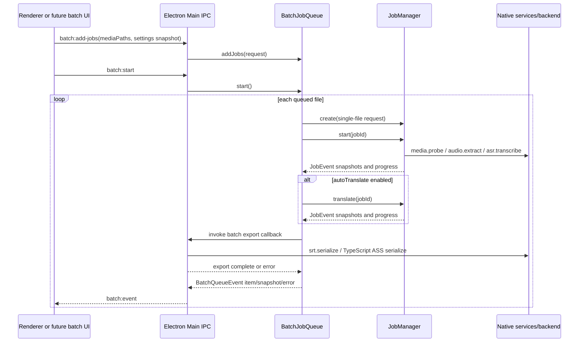

# Translate-Ter 架构说明

本文档记录 PR13 集成完成后的当前代码结构、模块边界和核心数据流。它描述的是已落地现状，不再把架构更新中的目标态和待拆分事项混在一起。

## 1. 产品与运行形态

Translate-Ter 是一个本地优先的桌面字幕工作流应用，核心流程是：

```text
导入音视频 -> ASR 转写 -> 字幕编辑 -> LLM 翻译 -> 导出 SRT/ASS
```

主线运行形态是 Electron 桌面应用：

- Renderer：React + TypeScript 单页应用，负责工作台、设置页和状态展示。
- Preload：通过 `contextBridge` 暴露受控的 `window.translateTer` API。
- Electron Main：负责 IPC、文件系统、设置、密钥、任务编排、provider registry/adapter 和 native 进程边界。
- Native Backend：C++ 可执行程序，通过换行 JSON stdio 协议提供本地媒体、字幕和 `whisper.cpp` 能力。

Windows 仍会构建 WebView2 native host 作为本地验证目标，但发布主线统一为 Electron 桌面包，不再提供 Windows native unzip-and-run 包。

## 2. 顶层目录

```text
apps/desktop/src/main      Electron main、IPC、任务、设置、资产和 provider 服务
apps/desktop/src/preload   Renderer 与 Main 之间的安全桥
apps/desktop/src/renderer  React UI、gateway、view-model、组件和样式
apps/desktop/src/shared    共享类型、provider catalog、字幕模型、SRT/ASS、语言和翻译核心逻辑
apps/native-host           Windows-only Win32/WebView2 native host
backend/cpp                C++ native backend
contracts                  Native 协议说明
docs                       架构、运行时和平台验证文档
resources                  Whisper runtime/model manifest 与 Python runner
scripts                    构建、打包、验证和 native 依赖脚本
```

## 3. 分层架构



### 3.1 Renderer UI

主要目录：

```text
apps/desktop/src/renderer/
  api/
  app/
  components/
  viewModels/
  i18n.ts
  styles.css
  main.tsx
```

当前职责：

- `main.tsx` 只负责 React mount。
- `app/App.tsx` 负责应用级装配、全局消息、视图切换和页面组合。
- `api/translateTerGateway.ts` 是 Renderer 内默认的桌面 API 入口，也是直接访问 `window.translateTer` 的集中位置。
- `viewModels/*` 负责读取设置、订阅任务与资产事件、派生 UI 状态、调用 gateway。
- `components/*` 负责展示和局部交互，不直接写 IPC 细节。

Renderer 不直接读写本地文件、不持有 provider 密钥、不启动 native 进程。

### 3.2 Preload Bridge

入口文件：`apps/desktop/src/preload/index.ts`

Preload 通过 `contextBridge.exposeInMainWorld` 暴露 `window.translateTer`。它是 Renderer 与 Electron Main 的受控 API 边界，主要包含：

- `desktop`：选择媒体文件。
- `jobs`：创建、启动、翻译、取消、读取任务，并订阅任务事件。
- `subtitles`：导入、导出、更新字幕段。
- `settings`：读写公开设置，读写 provider secret，执行 provider health check。
- `assets`：列出、安装、验证 Whisper/FFmpeg/faster-whisper 资产。
- `native`：读取 native backend 健康状态。
- `logs`：把 Renderer 日志写回 Main 日志系统。

### 3.3 Electron Main

入口文件：`apps/desktop/src/main/index.ts`

Electron Main 是桌面能力聚合层，主要职责包括：

- 创建应用窗口，加载开发 URL 或生产 renderer 文件。
- 注册 IPC handler。
- 管理文件选择、导出路径规划、手动覆盖确认，以及批量导出的重名避让。
- 管理批量任务队列、队列快照、队列事件和单项错误隔离。
- 管理设置和密钥存储。
- 广播设置变更给所有存活窗口，为后续多窗口设置同步保留 Main 侧基础设施。
- 初始化日志系统。
- 转发 `jobs:event`、`assets:event`、`batch:event` 和 `settings:event` 给相关 Renderer 窗口。
- 组合 `JobManager`、`NativeBackendClient`、`NativeMediaService`、`NativeSubtitleService`、`WhisperAssetManager`、`FfmpegAssetManager`、`FasterWhisperService` 等服务实例。
- 通过 provider registry/adapter 组合 ASR 与 translation 扩展点。

### 3.4 批量队列边界

批量处理由 Electron Main 的 `BatchJobQueue` 编排。队列层只管理多个文件的入队、启动、取消、队列快照和错误隔离；单文件媒体探测、音频抽取、ASR、翻译仍复用 `JobManager`。这样可以保持 provider adapter 和 native 能力边界不变。

当前队列按串行方式执行。原因是 native cancel 边界仍是 `job.cancel` / `cancelRunningWork` 的全局本地工作取消语义；在该边界细化前，串行队列可以避免一个文件的取消误伤其他正在执行的 native 任务。

批量队列不新增 C++ native protocol 命令。它复用现有 `runtime.health`、`media.probe`、`audio.extract`、`asr.transcribe`、`srt.parse`、`srt.serialize` 和 `job.cancel`。

### 3.5 共享领域层

主要目录：`apps/desktop/src/shared`

共享层包含不依赖 Electron 的领域模型和纯逻辑：

- `models.ts`：字幕、任务、设置、native 协议、资产状态等类型。
- `providers/catalog.ts` / `providers/types.ts`：provider 元数据、secret 字段 schema 和可见性定义。
- `srt.ts` / `ass.ts`：字幕解析和序列化能力。
- `subtitleLayout.ts`：字幕布局和时间轴规范化。
- `languages.ts`：语言代码和标签。
- `translation/*`：翻译批处理、调度、限流、重试、熔断和 provider 抽象。

这层可以被 Main、Renderer 和测试共同使用，是领域规则与 provider 元数据的主要承载点。

## 4. Provider 与 Native 边界

### 4.1 Provider catalog 与 registry

当前 provider 扩展边界分成两层：

- `apps/desktop/src/shared/providers/catalog.ts`：统一记录 provider 元数据、secret 字段、设置页可见性和默认值。
- `apps/desktop/src/main/providers/*`：Main 侧 registry/adapter/factory，根据 catalog 中的 provider id 注册具体实现。

当前原则：

- Renderer 根据 catalog 渲染 provider 相关设置与状态卡片。
- Main 根据 registry/adapter 执行 ASR 或 translation provider。
- `JobManager` 只编排流程，不重新吸收 provider HTTP 或本地 provider 的实现细节。

### 4.2 Native backend 边界

协议文档：`contracts/native-protocol.md`

Electron Main 拥有 native 进程边界。Renderer 永远不直接 spawn C++ backend。

当前命令类型：

```text
runtime.health
media.probe
audio.extract
asr.transcribe
srt.parse
srt.serialize
job.cancel
```

C++ backend 当前负责：

- 检查 runtime 和本地工具健康状态。
- 调用 `ffprobe` 探测媒体。
- 调用 `ffmpeg` 抽取音频。
- 调用 `whisper.cpp` CLI 执行本地转写。
- 提供 SRT parse/serialize 的 native 协议入口。

C++ backend 不负责：

- 下载 runtime 或模型。
- 读取 manifest URL。
- 验证 SHA-256 信任策略。
- 管理 provider secret。
- 调用云端 provider HTTP。
- 直接服务 Renderer。

## 5. 核心工作流

### 5.1 ASR 转写流程

核心编排文件：`apps/desktop/src/main/services/jobManager.ts`



ASR provider 与 runtime variant 是两层决策：

- ASR provider 决定由谁执行识别：`local.whisper.cpp`、`local.faster-whisper`、`cloud.openai`、`mock.asr`。
- Runtime variant 决定本地 runtime 偏好：`cpu`、`cuda`、`metal`、`vulkan`。

当前执行边界：

- `local.whisper.cpp`：Main 解析并验证 runtime/model 后，把 runtime payload 发给 C++ backend。
- `local.faster-whisper`：由 Electron Main 的 Python-side service 执行，不走 C++ `whisper.cpp` backend。
- `cloud.openai`：由 Main 侧 adapter 调用 OpenAI Audio Transcriptions 兼容接口。
- `mock.asr`：仅作为显式开发 provider，不应隐式返回 mock 字幕。

### 5.2 翻译流程

核心文件：

- `apps/desktop/src/shared/translation/scheduler.ts`
- `apps/desktop/src/main/providers/translationProviderRegistry.ts`

翻译不由 Renderer 直接调用模型。`JobManager.translate()` 读取作业与设置，创建共享翻译调度器，然后由 Main 侧 registry/factory 提供 provider 实现：

- 根据字幕段创建批次。
- 按 provider 优先级排序。
- 执行并发调度。
- 使用 request/token 双 token bucket 限流。
- 使用 retry/backoff 处理可重试错误。
- 使用 circuit breaker 暂停持续失败的 provider。
- 校验 provider 返回的 segment id，防止错位、遗漏和重复。
- 对失败批次保留原文，并把 warning 写入字幕元数据。

当前主要 provider：

- `openai.compatible`：OpenAI-compatible Chat Completions JSON 输出协议。
- `mock.local`：测试和离线 workflow 用的确定性 mock provider。

### 5.3 字幕导入与导出

导入：

- Renderer 请求 `subtitles.importSrt(path)`。
- Main 读取文件文本。
- Main 通过 `NativeSubtitleService` 调 native backend 的 `srt.parse`。
- 返回共享 `SubtitleDocument`。

导出：

- Renderer 请求 `exportConfiguredSrt` 或 `subtitles.exportSrt`。
- Main 根据设置解析导出目录、文件名、格式和双语顺序。
- 手动导出在目标文件已存在时会弹覆盖确认；批量自动导出不会弹窗，而是通过追加 `-2`、`-3` 等后缀避让重名文件。
- 批量自动导出可按设置在译文文件名中追加目标语种后缀，例如 `video_zh-CN.srt`。
- SRT 导出优先走 native `srt.serialize`。
- ASS 导出继续使用共享 `serializeAss`。

### 5.4 批量处理流程

核心编排文件：

- `apps/desktop/src/main/services/batchJobQueue.ts`
- `apps/desktop/src/main/services/jobManager.ts`



单项失败会标记为 `failed` 并继续处理后续 queued item；取消队列会取消当前 active job，并把尚未开始的 queued item 标记为 `cancelled`。成功项在队列层会触发自动导出：`autoTranslate=true` 时导出 `translated` 变体，否则导出 `source` 变体，并复用全局导出目录、格式、双语顺序和语种后缀设置。若批量导出期间收到取消请求，item 会保持 `cancelled`，不会在导出回调返回后被覆盖成 `completed`。

## 6. 设置、密钥与资产管理

### 6.1 设置

核心文件：`apps/desktop/src/main/services/settingsStore.ts`

公开设置写入 Electron `userData/settings.json`。设置层负责：

- 默认值生成。
- schemaVersion 固定。
- 语言代码规范化。
- 翻译并发、RPM、token budget、batch 参数 clamp。
- 旧 CUDA 字段与新 acceleration 字段兼容迁移。
- 导出格式和导出目录设置。

### 6.2 密钥

Provider secret 写入 `userData/secrets/<providerId>.json`。

优先使用 Electron `safeStorage` 加密；如果系统不可用，会落到带 warning 的 plaintext fallback。Renderer 只通过 Preload API 请求 secret，不直接访问文件。

### 6.3 运行时资产

主要服务：

- `WhisperAssetManager`：`whisper.cpp` runtime/model manifest、缓存、下载、SHA-256 验证、runtime selection。
- `FfmpegAssetManager`：FFmpeg/FFprobe 安装与检测。
- `FasterWhisperService`：Python runner、faster-whisper runtime 与 CUDA runtime 相关能力。

资产事件通过 `assets:event` 推给 Renderer，用于展示下载进度、验证、解压、ready/error 状态。

## 7. 构建与发布

主要 npm scripts：

```text
npm run dev                Electron + Vite 开发模式
npm run build              TypeScript 检查并构建 out/
npm run test               Vitest
npm run native:configure   CMake 配置 native backend
npm run native:build       构建 native backend，Windows 同时构建 WebView2 host
npm run package:electron   跨平台 Electron 打包
npm run smoke:native       native backend 本地 smoke check
npm run verify:platform    平台验证辅助脚本
```

Electron 打包入口：

- `package.json` 的 `main` 指向 `out/main/index.js`。
- electron-builder 的 `files` 包含 `out/**`、`resources/whisper-manifest.json` 和 native backend。
- `extraResources` 包含 whisper manifest 与 faster-whisper Python runner。

## 8. 关键架构原则

- Renderer 通过 gateway/view-model 访问桌面 API，组件不直接写 IPC 细节。
- `provider catalog` 是 provider 元数据、设置字段和可见性规则的统一来源。
- Electron Main 是权限、密钥、文件系统和 native 进程边界。
- `JobManager` 负责工作流编排，不重新吸收 provider adapter 的实现细节。
- Native backend 只执行本地工具和协议命令，不做下载、信任策略、provider secret 或云端 HTTP。
- 长任务通过 `JobSnapshot` 和 `JobEvent` 推进，Renderer 被动订阅状态变化。
- 批量任务通过 Main 侧 `BatchQueueSnapshot` 和 `BatchQueueEvent` 推进，单文件执行继续复用 `JobManager`。
- Native protocol 保持稳定，新增命令需要单独演进与文档更新。
