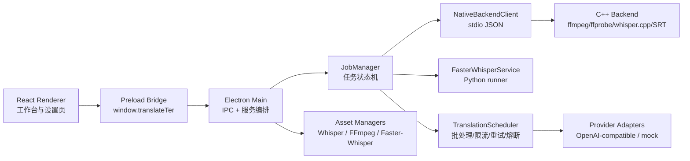
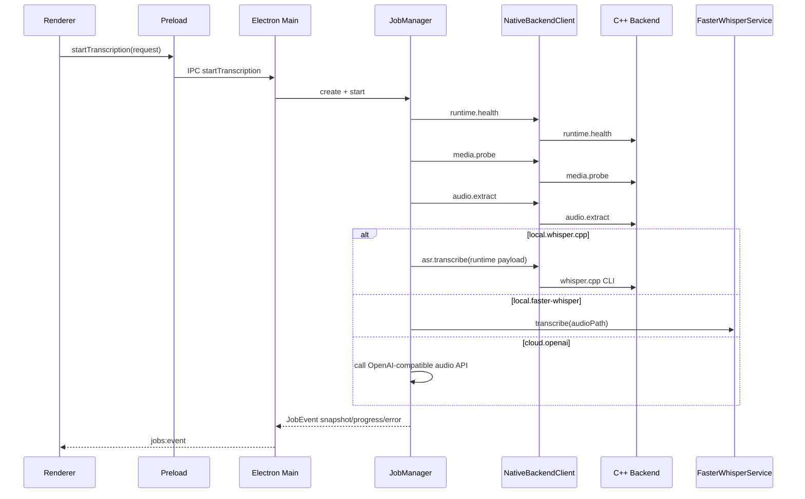

# Translate-Ter 架构说明

本文档记录 Translate-Ter 当前代码库的主要架构、模块边界和核心数据流。它描述的是现状，不引入新的实现约束。

## 1. 产品与运行形态

Translate-Ter 是一个本地优先的桌面字幕工作流应用，核心流程是：

```text
导入音视频 -> ASR 转写 -> 字幕编辑 -> LLM 翻译 -> 导出 SRT/ASS
```

主线运行形态是 Electron 桌面应用：

- Renderer：React + TypeScript 单页应用，负责工作台和设置界面。
- Preload：通过 `contextBridge` 暴露受控的 `window.translateTer` API。
- Electron Main：负责 IPC、文件系统、设置、密钥、任务编排、资产管理和 native 进程边界。
- Native Backend：C++ 可执行程序，通过换行 JSON stdio 协议提供本地媒体、字幕和 whisper.cpp 能力。

Windows 还保留一个 WebView2 native host 打包形态。它是 Windows-only 的入口程序，用于 unzip-and-run 包，不是跨平台主线。

## 2. 顶层目录

```text
apps/desktop/src/main      Electron main、IPC、任务、设置、资产和 provider 服务
apps/desktop/src/preload   Renderer 与 Main 之间的安全桥
apps/desktop/src/renderer  React UI、i18n、工作台和设置页
apps/desktop/src/shared    共享类型、字幕模型、SRT/ASS、语言、翻译核心逻辑
apps/native-host           Windows-only Win32/WebView2 native host
backend/cpp                C++ native backend
contracts                  Native 协议说明
docs                       架构、运行时和平台验证文档
resources                  Whisper runtime/model manifest 与 Python runner
scripts                    构建、打包、验证和 native 依赖脚本
```

## 3. 分层架构



### 3.1 Renderer UI

入口文件：`apps/desktop/src/renderer/main.tsx`

Renderer 是单页 React 应用，主要职责包括：

- 展示导入、ASR、字幕、翻译、导出工作流。
- 展示并编辑字幕段。
- 展示模型、FFmpeg、native backend、provider 健康状态。
- 展示下载、验证、任务进度和警告。
- 调用 `window.translateTer` 发起桌面能力请求。

Renderer 不直接读写本地文件、不持有 provider 密钥、不启动 native 进程。

### 3.2 Preload Bridge

入口文件：`apps/desktop/src/preload/index.ts`

Preload 通过 `contextBridge.exposeInMainWorld` 暴露 `window.translateTer`。它是 Renderer 与 Electron Main 的受控 API 边界，主要包含：

- `desktop`：选择媒体文件。
- `jobs`：创建、启动、翻译、取消、读取任务，并订阅任务事件。
- `subtitles`：导入、导出、更新字幕段。
- `settings`：读写公开设置，读写 provider secret。
- `assets`：列出、安装、验证 Whisper/FFmpeg/faster-whisper 资产。
- `native`：读取 native backend 健康状态。
- `logs`：把 Renderer 日志写回 Main 日志系统。

### 3.3 Electron Main

入口文件：`apps/desktop/src/main/index.ts`

Electron Main 是桌面能力聚合层，主要职责包括：

- 创建应用窗口，加载开发 URL 或生产 renderer 文件。
- 注册 IPC handler。
- 管理文件选择、导出路径和覆盖确认。
- 管理设置和密钥存储。
- 初始化日志系统。
- 转发 `jobs:event` 和 `assets:event` 给 Renderer。
- 持有 `JobManager`、`NativeBackendClient`、`WhisperAssetManager`、`FfmpegAssetManager`、`FasterWhisperService` 等服务实例。

### 3.4 共享领域层

主要目录：`apps/desktop/src/shared`

共享层包含不依赖 Electron 的领域模型和纯逻辑：

- `models.ts`：字幕、任务、设置、native 协议、资产状态等类型。
- `srt.ts` / `ass.ts`：字幕解析和序列化。
- `subtitleLayout.ts`：字幕布局和时间轴规范化。
- `languages.ts`：语言代码和标签。
- `translation/*`：翻译批处理、调度、限流、重试、熔断和 provider 抽象。

这层可以被 Main、Renderer 和测试共同使用，是领域规则的主要承载点。

## 4. 核心工作流

### 4.1 ASR 转写流程

核心编排文件：`apps/desktop/src/main/services/jobManager.ts`



ASR provider 与 runtime variant 是两层决策：

- ASR provider 决定由谁执行识别：`local.whisper.cpp`、`local.faster-whisper`、`cloud.openai`、`mock.asr`。
- Runtime variant 决定本地 runtime 偏好：`cpu`、`cuda`、`metal`、`vulkan`。

当前执行边界：

- `local.whisper.cpp`：Electron Main 解析并验证 runtime/model 后，把 runtime payload 发给 C++ backend。
- `local.faster-whisper`：由 Electron Main 的 Python-side service 执行，不走 C++ whisper.cpp backend。
- `cloud.openai`：由 Electron Main 调用 OpenAI Audio Transcriptions 兼容接口。
- `mock.asr`：仅作为显式开发 provider，不应隐式返回 mock 字幕。

### 4.2 翻译流程

核心文件：

- `apps/desktop/src/shared/translation/scheduler.ts`
- `apps/desktop/src/shared/translation/providers.ts`

翻译不由 Renderer 直接调用模型。`JobManager.translate()` 读取 provider secret，创建 `TranslationScheduler`，然后由共享翻译核心完成：

- 根据字幕段创建批次。
- 按 provider 优先级排序。
- 执行并发调度。
- 使用 request/token 双 token bucket 限流。
- 使用 retry/backoff 处理可重试错误。
- 使用 circuit breaker 暂停持续失败的 provider。
- 校验 provider 返回的 segment id，防止错位、遗漏和重复。
- 对失败批次保留原文，并把 warning 写入字幕元数据。

当前主要 provider：

- `openai.compatible`：OpenAI-compatible Chat Completions JSON 输出协议。
- `mock.local`：测试和离线 workflow 用的确定性 mock provider。

### 4.3 字幕导入与导出

导入：

- Renderer 请求 `subtitles.importSrt(path)`。
- Main 读取文件文本。
- Main 通过 native backend 调 `srt.parse`。
- 返回共享 `SubtitleDocument`。

导出：

- Renderer 请求 `exportConfiguredSrt` 或 `subtitles.exportSrt`。
- Main 根据设置解析导出目录、文件名、格式和双语顺序。
- Main 使用共享 `serializeSrt` 或 `serializeAss` 写入文件。

## 5. Native Backend 协议

协议文档：`contracts/native-protocol.md`

Electron Main 拥有 native 进程边界。Renderer 永远不直接 spawn C++ backend。

开发 backend 支持：

```text
translate-ter-backend --health
translate-ter-backend --stdio-json
```

`--stdio-json` 使用换行 JSON：

- stdin 每一行是一个 request。
- stdout 每一行是一个 response。
- request/response 都带 `protocolVersion`、`requestId` 和 `type`。

当前命令类型：

```text
runtime.health
media.probe
audio.extract
asr.transcribe
srt.parse
srt.serialize
job.cancel
```

C++ backend 当前负责：

- 检查 runtime 和本地工具健康状态。
- 调用 `ffprobe` 探测媒体。
- 调用 `ffmpeg` 抽取音频。
- 调用 whisper.cpp CLI 执行本地转写。
- 解析 whisper.cpp 生成的 SRT/JSON 输出。
- 提供 SRT parse/serialize 的 native 协议入口。

C++ backend 不负责：

- 下载 runtime 或模型。
- 读取 manifest URL。
- 验证 SHA-256 信任策略。
- 管理 provider secret。
- 直接服务 Renderer。

## 6. 设置、密钥与资产管理

### 6.1 设置

核心文件：`apps/desktop/src/main/services/settingsStore.ts`

公开设置写入 Electron `userData/settings.json`。设置层负责：

- 默认值生成。
- schemaVersion 固定。
- 语言代码规范化。
- 翻译并发、RPM、token budget、batch 参数 clamp。
- 旧 CUDA 字段与新 acceleration 字段兼容迁移。
- 导出格式和导出目录设置。

### 6.2 密钥

Provider secret 写入 `userData/secrets/<providerId>.json`。

优先使用 Electron `safeStorage` 加密；如果系统不可用，会落到带 warning 的 plaintext fallback。Renderer 只通过 Preload API 请求 secret，不直接访问文件。

### 6.3 运行时资产

主要服务：

- `WhisperAssetManager`：whisper.cpp runtime/model manifest、缓存、下载、SHA-256 验证、runtime selection。
- `FfmpegAssetManager`：FFmpeg/FFprobe 安装与检测。
- `FasterWhisperService`：Python runner、faster-whisper runtime 与 CUDA runtime 相关能力。

资产事件通过 `assets:event` 推给 Renderer，用于展示下载进度、验证、解压、ready/error 状态。

## 7. 构建与发布

主要 npm scripts：

```text
npm run dev                Electron + Vite 开发模式
npm run build              TypeScript 检查并构建 out/
npm run test               Vitest
npm run native:configure   CMake 配置 native backend
npm run native:build       构建 native backend，Windows 同时构建 WebView2 host
npm run native:package     Windows-only native unzip-and-run 包
npm run package:electron   跨平台 Electron 打包
npm run smoke:native       native backend 本地 smoke check
npm run verify:platform    平台验证辅助脚本
```

Electron 打包入口：

- `package.json` 的 `main` 指向 `out/main/index.js`。
- electron-builder 的 `files` 包含 `out/**`、`resources/whisper-manifest.json` 和 native backend。
- `extraResources` 包含 whisper manifest 与 faster-whisper Python runner。

Windows native 包形态：

```text
dist/native/
  TranslateTer.exe
  WebView2Loader.dll
  app/
    frontend/
    backend/translate-ter-backend.exe
    resources/whisper-manifest.json
```

## 8. 关键架构原则

- Renderer 只负责交互和展示，不直接接触本地敏感能力。
- Electron Main 是权限、密钥、文件系统和 native 进程边界。
- 共享领域层承载可测试的字幕和翻译规则。
- Native backend 只执行本地工具和协议命令，不做下载和信任决策。
- ASR provider 与 runtime variant 分层，避免把 provider 选择和硬件加速选择耦合。
- 长任务通过 `JobSnapshot` 和 `JobEvent` 推进，Renderer 被动订阅状态变化。
- Provider secret 不进入 Renderer 全局状态之外的文件系统通道。

## 9. 当前复杂度与后续关注点

当前架构边界整体清晰，但有几个需要持续关注的复杂区域：

- `apps/desktop/src/renderer/main.tsx` 承载了大量 UI、状态派生和交互逻辑，后续功能继续增长时适合拆分为页面、面板、hooks 和 view-model。
- ASR runtime 兼容层同时处理旧 CUDA 字段、新 acceleration 字段、平台差异和 fallback，修改时应优先补充单元测试。
- Native backend 的 JSON 处理偏轻量，协议字段继续扩展时要注意 malformed input、转义和兼容性。
- Windows native host 当前注入的是临时 frontend adapter，后续若要成为完整运行形态，需要把 adapter 接到真实 native backend 协议。
